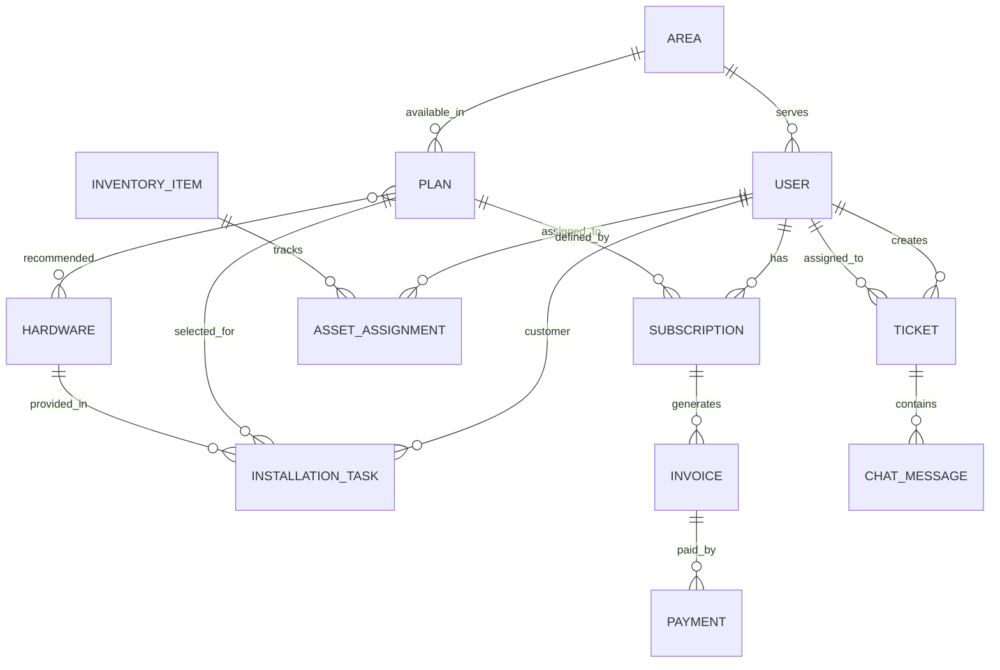

# Database Schema - NextGenISP

This document outlines the database design for the NextGenISP project. The system is built using Django and uses a relational database (SQLite in development).

## Entity Relationship Diagram

---

## 1. Master Data

### [Area](file:///e:/Backup/Main%20%20projecct/NextGenISP/backend/api/models.py#6-17)
Stores geographic zones managed by the ISP.

| Field | Type | Description |
| :--- | :--- | :--- |
| `id` | AutoInternal | Primary Key |
| `name` | Char(100) | Name of the area |
| `code` | Char(20) | Unique Zone Code (e.g., KOC-01) |
| `city` | Char(100) | City (Default: Kochi) |
| `description` | Text | Internal notes |
| `coordinates` | Text | JSON list of [lat, lng] for polygon map |
| `is_under_maintenance` | Boolean | Global toggle for status warnings |
| `maintenance_message`| Char(255) | Specific warning text |

### [Plan](file:///e:/Backup/Main%20%20projecct/NextGenISP/backend/api/models.py#52-70)
Defines internet service packages.

| Field | Type | Description |
| :--- | :--- | :--- |
| `id` | AutoInternal | Primary Key |
| `name` | Char(100) | Plan Name |
| `hero_tagline` | Char(200) | Marketing phrase |
| `speed_mbps` | Integer | Speed in Mbps |
| `data_limit_gb` | Integer | Monthly FUP limit |
| `price` | Decimal | Monthly cost |
| `plan_type` | Choice | FIBER / WIRELESS |
| `areas` | M2M | Areas where this plan is available |
| `features` | Text | Comma-separated benefits |
| `recommended_hardware`| M2M | Hardware suggested for this plan |

### [Hardware](file:///e:/Backup/Main%20%20projecct/NextGenISP/backend/api/models.py#214-227)
Catalog of routers and devices available for customers.

| Field | Type | Description |
| :--- | :--- | :--- |
| `name` | Char(100) | Device Name |
| `hero_tagline` | Char(200) | Catchy slogan |
| `description` | Text | General details |
| `features` | Text | Key features |
| `specifications` | Text | JSON format specs |
| `price` | Decimal | Sale/Rent price |
| `image` | Image | Product photo |

---

## 2. Identity & Subscriptions

### [User](file:///e:/Backup/Main%20%20projecct/NextGenISP/backend/api/models.py#19-50)
Custom user model extending Django's `AbstractUser`.

| Field | Type | Description |
| :--- | :--- | :--- |
| `role` | Choice | ADMIN, TECHNICAL_STAFF, FIELD_STAFF, CUSTOMER |
| `status` | Choice | LEAD, VERIFIED, READY_TO_INSTALL, ACTIVE, etc. |
| `phone_number` | Char(15) | Contact number |
| `address` | Text | Physical address |
| `area` | ForeignKey | Assigned Area |
| `latitude` / `longitude` | Float | GPS coordinates for network map |

### [Subscription](file:///e:/Backup/Main%20%20projecct/NextGenISP/backend/api/models.py#72-87)
Active plans linked to customers.

| Field | Type | Description |
| :--- | :--- | :--- |
| `user` | ForeignKey | The customer |
| `plan` | ForeignKey | Selected plan |
| `start_date` | Date | Activation date |
| `end_date` | Date | Expiry date |
| `status` | Choice | ACTIVE, EXPIRED, SUSPENDED |
| `billing_cycle` | Char(20) | e.g., MONTHLY |

---

## 3. Billing & Payments

### [Invoice](file:///e:/Backup/Main%20%20projecct/NextGenISP/backend/api/models.py#89-105)
Records of charges.

| Field | Type | Description |
| :--- | :--- | :--- |
| `subscription` | ForeignKey | Linked subscription |
| `description` | Char(200) | Purpose (e.g., Monthly Charge) |
| `amount` | Decimal | Total due |
| `issue_date` | Date | Date generated |
| `due_date` | Date | Payment deadline |
| `status` | Choice | PENDING, PAID, OVERDUE |
| `upgrade_to_plan` | ForeignKey | If set, paying this upgrades the plan |

### [Payment](file:///e:/Backup/Main%20%20projecct/NextGenISP/backend/api/models.py#106-115)
Transaction records.

| Field | Type | Description |
| :--- | :--- | :--- |
| `invoice` | ForeignKey | Linked invoice |
| `transaction_id` | Char(100) | Unique gateway ID |
| `amount` | Decimal | Paid amount |
| `payment_date` | DateTime | Timestamp |
| `method` | Char(50) | ONLINE or CASH |

---

## 4. CRM & Operations

### [Ticket](file:///e:/Backup/Main%20%20projecct/NextGenISP/backend/api/models.py#129-153)
Support and service requests.

| Field | Type | Description |
| :--- | :--- | :--- |
| `customer` | ForeignKey | Who raised the ticket |
| `assigned_to` | ForeignKey | Staff member handling it |
| `ticket_type` | Choice | LOGICAL, PHYSICAL, INSTALLATION |
| `subject` | Char(200) | Brief description |
| `status` | Choice | OPEN, IN_PROGRESS, RESOLVED, CLOSED |

### [InstallationTask](file:///e:/Backup/Main%20%20projecct/NextGenISP/backend/api/models.py#164-192)
Workflow for new customer onboarding.

| Field | Type | Description |
| :--- | :--- | :--- |
| `customer` | ForeignKey | Target customer |
| `assigned_staff` | ForeignKey | Field staff (Physical setup) |
| `assigned_tech_staff`| ForeignKey | Technical staff (Config) |
| `plan` | ForeignKey | Plan to install |
| `hardware` | ForeignKey | Standard router if selected |
| `status` | Choice | PENDING, IN_PROGRESS, COMPLETED, CLOSED |

---

## 5. Inventory & Assets

### [InventoryItem](file:///e:/Backup/Main%20%20projecct/NextGenISP/backend/api/models.py#228-238)
Stock levels in the warehouse.

| Field | Type | Description |
| :--- | :--- | :--- |
| `name` | Char(100) | Item name |
| `sku` | Char(50) | Unique identifier |
| `quantity` | Integer | Current stock |
| `low_stock_threshold`| Integer | Alert level |

### [AssetAssignment](file:///e:/Backup/Main%20%20projecct/NextGenISP/backend/api/models.py#239-248)
Tracks hardware issued to users (Staff or Customers).

| Field | Type | Description |
| :--- | :--- | :--- |
| `item` | ForeignKey | Type of item |
| `user` | ForeignKey | Assigned to |
| `serial_number` | Char(100) | Specific device ID |
| `is_returned` | Boolean | Check-in status |
